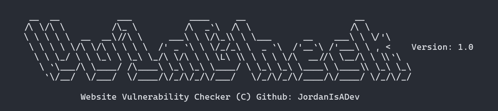

# Vuln Check

## What is Vuln Check?
**[Vuln Check](https://github.com/jordanisadev/vuln_check)** is a tools programmed in Python that serves as a tool to scans for a website possibile of having a security vulnerability.
## How To Use
To use the tools, first you need to understand basic things on Python and most important is, having a brain.
You need to have the requirements installed on your device.
### Requirements
* Python 3.12+
* BeautifulSoup library
* Requests library
### Installation
```
$ pip install bs4
$ pip install requests
```
### Run The Tools
```
$ python vuln_check.py
```